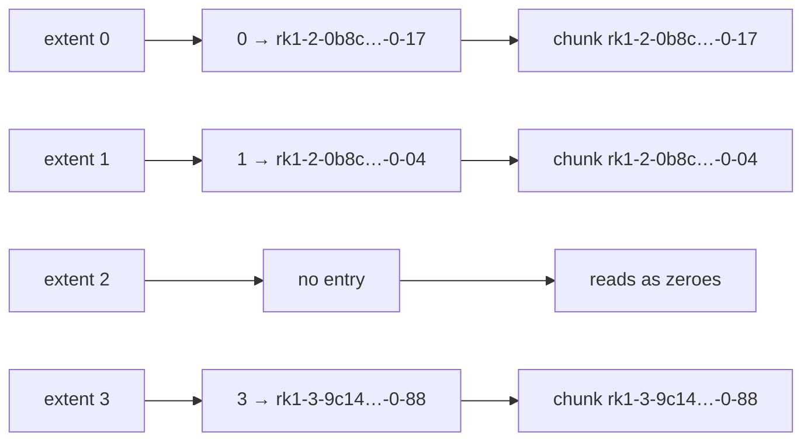

# Design

silo's bet is that storage you can operate beats storage with every feature. One
component, deployed the same way everywhere, with as few decisions as possible
between you and a working volume.

Five choices follow from that bet. A feature that would violate one doesn't ship.

## Principles

**One binary, symmetric nodes.** Every node runs the same `silod` and can do every
job. There are no monitor, metadata, or OSD roles to size, place, and babysit. You
deploy one thing and scale it by adding more of the same.

**No quorum to lose.** Membership is SWIM gossip and the namespace is a CRDT, so a
partition keeps serving on both sides and converges when the network heals. No
Raft, no "2 of 3 monitors up". A node joins by pointing at one peer and leaves by
dying. Re-replication is a paced background task rather than a stop-the-world
rebalance.

**Recoverable by default.** No protocol step needs a human to break a tie. A volume
is an extent map of immutable, encrypted chunks under a fenced single-writer lease,
so a split brain cannot corrupt it and snapshots cost nothing.

**Errors are instructions.** Every error says what to do next, not just what broke.

**Stdlib-first.** External dependencies need justification. The FUSE protocol and
CSI bindings are built in-tree, and volumes attach over NBD from the mainline
kernel, so there is no client to install and little to audit.

## How a volume is stored

A silo volume is not a file. It is a map from extent index to chunk id, and the
chunks are immutable encrypted blobs that live independently of any volume.

Reading at some offset means finding the extent that offset falls in, looking that
extent up in the map, and fetching the chunk it names. Left to right below: the
volume's logical extents (256 KiB each by default), the extent map, and the chunk
store, where every chunk is immutable, AES-GCM encrypted, and present on all N
replicas.

Four consequences follow from that shape, and most of silo's behaviour is one of
them:

**Volumes are sparse.** Extent 2 has no entry, so it was never written and reads
as zeroes. A 10 GiB volume with 40 MiB written costs 40 MiB.

**Snapshots are free.** A snapshot copies the map, not the data. Both maps point
at the same immutable chunks, and neither can disturb the other.

**Overwrites do not overwrite.** Writing to extent 1 mints a new chunk, replicates
it, and rebinds the map entry. The chunk it replaced is still on disk, now
referenced by nothing. Reclaiming those is the chunk garbage collector's job, and
it is the reason silo has one at all. See
[operations.md](operations.md#configuration) for `SILO_CHUNK_GC_ENABLE`.

**A chunk id names a writer, not a volume.** The id is the writing node, a random
per-session identifier, and a counter. Chunks from one volume are scattered across
many such sets, and a set outlives the session that created it. This is why
reclamation has to be mark-and-sweep over the live reference set rather than a
per-volume delete.

## Capabilities

An ordinary `PersistentVolumeClaim` against the `silo` StorageClass becomes a
`ReadWriteOnce` device in your pod, with CSI-native snapshots and clones. The
fenced lease means a rescheduled pod takes over its disk instead of corrupting it,
and attachments survive a silod restart: volumes pause and reconnect rather than
returning I/O errors.

Every chunk lives on N nodes. Lose one and its chunks re-replicate onto the
survivors in the background, with nothing to babysit. Chunks are AES-GCM encrypted
with per-chunk keys and cluster traffic is mTLS; keys come from a file or from a
cloud KMS on AWS, GCP, or Azure.

The namespace keeps working on both sides of a split. `mkdir`, `touch`, `ls`, and
`rm` all converge afterward, and conflicts surface instead of being silently
dropped. Where you need many readers, a from-scratch FUSE surface gives you RWX
with close-to-open coherence.

Operationally you get Prometheus metrics, a Grafana overview dashboard built
around health markers rather than per-subject graphs, and a `siloctl` CLI for
status, draining, and capacity rebalancing.

## Trade-offs

Volumes are `ReadWriteOnce`. The FUSE surface is close-to-open coherent, in the
NFS sense, not POSIX-coherent. There is no erasure coding. If you need RWX or EC
today, silo isn't there yet; [known-gaps.md](known-gaps.md) is the honest list.

Writes are slower than Ceph's at default settings, deliberately: every write is
flushed to real disk on multiple nodes before silod says OK. There is no journal
to drain and no in-flight state to recover after a node loss, so the number you
benchmark on day one is the number production sees. You feel that cost on small
synchronous writes, much less on bulk sequential I/O. See
[performance.md](performance.md) for what each system actually does on a write.

## Status

| Capability | Status |
|---|---|
| Encrypted, replicated chunk store (AES-GCM, N=3, consistent-hash placement) | ✅ |
| Gossip membership (SWIM) + mTLS, token-based operator join | ✅ |
| CRDT namespace: partition-tolerant `mkdir`/`touch`/`ls`/`rm`, conflict surfacing | ✅ |
| Writer/reader SDKs, writer-owned chunks (no metadata round-trip on writes) | ✅ |
| Block volumes: extent map, fenced single-writer lease, NBD server, COW snapshots | ✅ |
| Kubernetes CSI driver: provision, attach, mount, snapshot, clone; Helm chart | ✅ |
| Restart-resilient attachments: volumes pause and reconnect across silod rollouts | ✅ |
| Chunk garbage collection: mark-and-sweep reclamation of copy-on-write orphans | ✅ |
| FUSE (RWX) filesystem surface: from-scratch protocol library, close-to-open | ✅ |
| Observability: Prometheus metrics, Grafana dashboard, `siloctl` status/drain/rebalance | ✅ |
| Security: cloud KMS keys (AWS/GCP/Azure), cert auto-rotation, CRL revocation, scoped tokens | ✅ |
| Durability: encrypted backup to S3/GCS/Azure, rolling-upgrade protocol handshake | ✅ |
| nvme-tcp block transport | ⏳ v1.1 (kernel-bound) |
